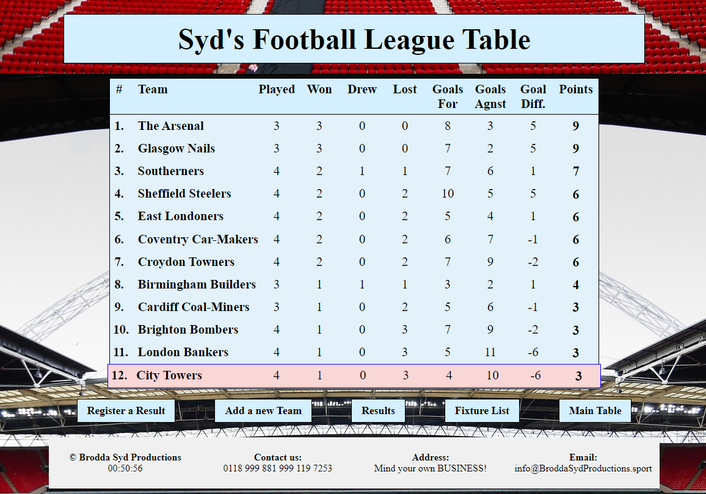

# My Football League Table
## About
During the Euro's I decided to do my own football league table as my Boolean React project. \
Here you can enter new teams & match results. You can also view team info, results and fixtures. \
Built using JavaScript, React & CSS for the Front-End hosted on Netlify.com \
The Back-End is a JSON server hosted on Heroku because Netlify does not support JSON

  

## How to build this app
mkdir boolean-uk-react-project \
cd boolean-uk-react-project \
git clone https://github.com/sydneymurray/boolean-uk-react-project.git 

## Start JSON Server
json-server --watch db/db.json  

## Start front end
Comment out the line: "`export let baseURL = process.env.REACT_APP_API_URL`" in src/components/data.js \
Uncomment the line "`//export let baseURL = "http://localhost:3500/`" in src/components/data.js \
npm run start

